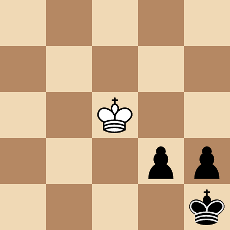
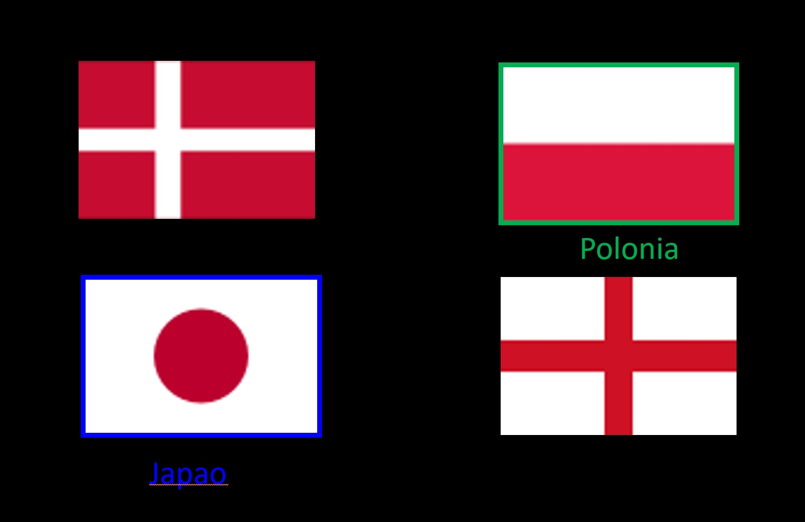
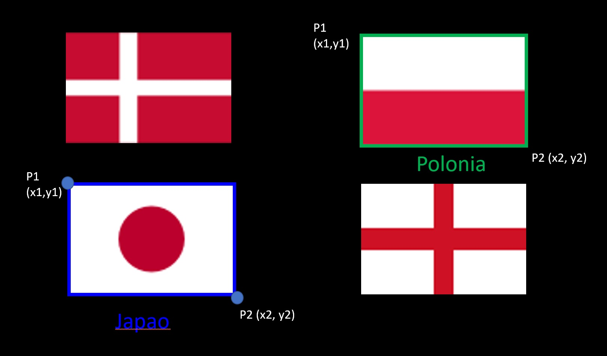
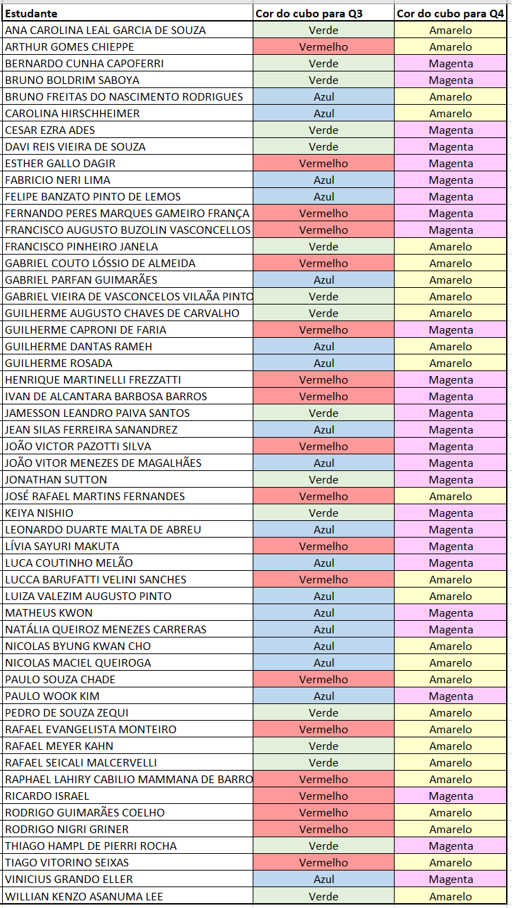

# Robótica Computacional 2021.1

[Mais orientações no README](./README.md)

## Prova P1 AI

**Você deve escolher somente 3 questões para fazer.**


Nome:_______________


Questões que fez:____________


Observações de avaliações nesta disciplina:

* Não fique em um canal/mesa do Teams. Trabalhe sozinho
* Inicie a prova no Blackboard para a ferramenta de Proctoring iniciar. Só finalize o Blackboard quando enviar a prova via Github classroom
* Só é necessário enviar a prova via Github Classroom uma vez
* Caso haja alguma falha ou queda de conexão avise ao professor e reabra o Proctoring. 
* Durante esta prova vamos registrar via Proctoring somente a tela, não a câmera nem microfone
* Ponha o nome no enunciado da prova
* Tenha os repositórios https://github.com/Insper/robot21.1/ ,  https://github.com/arnaldojr/my_simulation e https://github.com/arnaldojr/mybot_description.git  atualizados em seu `catkin_ws/src` .
* Você pode consultar a internet ou qualquer material, mas não pode se comunicar com pessoas ou colegas a respeito da prova
* Todos os códigos fornecidos estão executando perfeitamente. Foram testados no SSD da disciplina na versão 2021.1
* Teste sempre seu código enquanto desenvolver
* Entregue código que executa
* Faça commits e pushes frequentes no seu repositório (tem dicas [no final deste arquivo](./inst
rucoes_setup.md))
* Esteja com o Teams aberto e pronto para receber calls do professor e da equipe. 
* Avisos importantes serão dados no chat da prova no Teams, será feito o tag para a equipe toda para que você não precise ficar na ligação
* Permite-se consultar qualquer material online ou próprio. Não se pode compartilhar informações com colegas durante a prova
* A responsabilidade por ter o *setup* funcionando é de cada estudante
* Questões de esclarecimento geral podem ser perguntadas no chat do Teams
* Se você estiver em casa pode fazer pausas e falar com seus familiares, mas não pode receber ajuda na prova.
* É proibido colaborar ou pedir ajuda a colegas ou qualquer pessoa que conheça os assuntos avaliados nesta prova.
* Os exercícios admitem diversas estratégias de resolução. A prova de cada aluno é única


Existe algumas dicas de referência rápida de setup [instrucoes_setup.md](instrucoes_setup.md)

**Integridade Intelectual**

Se você tiver alguma evidência de cola ou fraude cometida nesta prova, [use este serviço de e-mail anônimo](https://www.guerrillamail.com/pt/compose)  para informar ao professor.  Ou [este formulário](https://forms.gle/JPhqjPmuKAHxmvwZ9)


# Questões


## Questão 1  (3.33 pontos)

Você deve fazer um programa que lê tabuleiros de finais de partidas de xadrez.

Para fins de simplicidade neste exercício só teremos **reis** e **peões**, e estaremos restritos a um tabuleiro $5$ por $5$.


**Exemplo:**

Para o tabuleiro a seguir

</img>

Seu programa deve retornar a lista abaixo:

```
[[' ', ' ', ' ', ' ', ' '],
[' ', ' ', ' ', ' ', ' '],
[' ', ' ', 'WK', ' ', ' '],
[' ', ' ', ' ', 'BP', 'BP'],
[' ', ' ', ' ', ' ', 'BK']]
```

Código de peças:

* WK é o rei branco
* BK é o rei preto
* WP é o peão branco
* BP é o peão preto

#### Orientações

Trabalhe no arquivo `q1/q1.py`. Este exercício **não precisa** de ROS. Portanto pode ser feito até em Mac ou Windows

Seu código vai estar na função `processa`, que recebe uma imagem BGR do tabuleiro e deve retornar uma lista de listas com o tabuleiro e também uma imagem de saída. 


Simplificações:
* O tabuleiro sempre aparece do mesmo tamanho
* O tabuleiro é 5 x 5

Todas as imagens necessárias já estão na pasta e já são lidas por `q1.py`


#### O que você deve fazer:

Fazer o programa devolver uma configuração de tabuleiro e uma imagem de saída. 

Se você precisar gerar mais de uma imagem de `debug` para demonstrar como seu programa funciona as exiba usando a função `cv2.imshow` dentro da função `processa`.

#### Dica: 

Você pode usar características específicas como tamanho, área e número de contornos das peças e posição das casas no tabuleiro. 


|Resultado| Conceito| 
|---|---|
| Não executa | zero |
| Segmenta todas as cores relevantes e produz saída visual demonstrando | 0.75|
| Demonstra separar entre peões e reis de uma mesma cor  | 1.2|
| Demonstra separar entre peões e reis de ambas as cores  | 1.5 |
| Retorna resultado certo na matriz tabuleiro para pelo menos um tipo de peça  | 1.9 |
| Retorna a matriz de tabuleiro correta a maioria das vezes | 2.75 |
| Resultados perfeitos | 3.33|

Casos intermediários ou omissos da rubrica serão decididos pelo professor.


## Questão 2  (3.33 pontos)

Você precisa desenvolver um programa que identifica num vídeo onde estão as bandeiras do Japão e da Polônia. 

Regras:
* Seu programa precisa desenhar numa imagem um retângulo de borda sobre onde estiverem os dois países de interesse
* Seu programa precisa devolver as coordenadas dos cantos que contém a bandeira do Japão e a da Polônia, seguindo o modelo que está no `q2.py`

As imagens de entrada são deste tipo:

</img>

Os países a identificar serão: 

</img>

A ordem em que os cantos (corners) da *bounding box* de cada país devem ser retornados é esta. Sempre Japão primeiro e depois Polônia. Basta seguir a sequência indicada no código em `q2.py`. 
     
</img>

Você vai trabalhar no vídeo `bandeiras_paises.mp4` que já está no diretório. 


#### Orientações

Trabalhe no arquivo `q2/q2.py`. Este exercício **não precisa** de ROS. Portanto pode ser feito até em Mac ou Windows

|Resultado| Conceito| 
|---|---|
| Não executa | zero |
| Segmenta ou filtra a imagem baseado em cores ou canais da imagem e produz output visual| 1.0|
| Encontra contornos, com output visual| 1.5|
| Identifica um dos países corretamente com output visual e corners corretos | 2.2|
|Identifica o outro corretamente com output visual claro e corners corretos | 2.9 |
| Resultados perfeitos | 3.33|


Casos intermediários ou omissos da rubrica serão decididos pelo professor.


## Questões de ROS

**Atenção: ** 

Para fazer estra questão você precisa ter o `my_simulation` e o `mybot_description` atualizado.

    cd ~/catkin_ws/src
    cd my_simulation
    git stash
    git pull

Ou então se ainda não tiver:

    cd ~/catkin_ws/src
    git clone https://github.com/arnaldojr/my_simulation.git

Para o mybot_description:

    cd ~/catkin_ws/src
    cd mybot_description
    git stash
    git pull

Ou então se ainda não tiver:

    cd ~/catkin_ws/src
    git clone https://github.com/arnaldojr/mybot_description


Em seguida faça o [catkin_make](./instrucoes_setup.md). 


## Tabela para questões 3 e 4

A tabela a seguir determina suas caixas preferenciais para as questões 3 e 4.

</img>


## Questão 3

Para executar o cenário, faça:

    roslaunch my_simulation circuito.launch

Note que o cenario está no repositório `my_simulation`, portanto é fundamental você já ter realizado os passos de atualização descritos acima.


Seu robô está num cenário como o que pode ser visto na figura: 

</img>


#### O que é para fazer

Faça o robô seguir a pista amarela até encontrar a sua caixa preferencial conforme a tabela abaixo. 

O robô não deve deixar a pista amarela, deve apenas seguir até se aproximar da caixa. Quando estiver próximo da caixa deve parar com a caixa em sua área de visão. Não é preciso que a caixa esteja bem centralizada. 

Para conseguir a questão completa é preciso conseguir fazer o robô seguir a pista rápido com base no ângulo da faixa amarela na imagem.

#### Dicas

Talvez estes conteúdos ajudem:

[Regressão trocando x-y com todos os pixels amarelos https://github.com/Insper/robot21.1/blob/main/aula03/aula03_RegressaoPixelsAmarelos.ipynb](https://github.com/Insper/robot21.1/blob/main/aula03/aula03_RegressaoPixelsAmarelos.ipynb)


[Centro de massa de pixels amarelos](https://github.com/Insper/robot21.1/blob/main/aula03/centro_do_amarelo.py)

#### Detalhes de como rodar


O código para este exercício deve estar em: `p1_211/scripts/Q3.py`

Para rodar, recomendamos que faça:

    roslaunch my_simulation circuito.launch

Depois o seu código:

    rosrun p1_211 Q3.py


|Resultado| Conceito| 
|---|---|
| Não executa | 0 |
| Filtra o amarelo| 0.5|
| Segue a pista com base em centro de massa | 1.33|
| Identifica caixa e para no lugar certo | +1|
| Usa o ângulo da faixa na tela para acelerar quando o robô está em trechos retos da pista | +1|


Casos intermediários ou omissos da rubrica serão decididos pelo professor.


## Questão 4 (3.33 pontos)

</img>


Seu robô está no cenário visível abaixo:


    roslaunch my_simulation caixas.launch


#### O que é para fazer

Faça o robô girar e fazer uma volta completa.

Durante esta volta completa, o robô deve *guardar* a posição da caixa mais próxima da cor desejada.

Depois de completada a volta, o robô deve retornar à posição e terminar centralizado na caixa mais próxima da cor desejada. Você pode determinar qual caixa é mais próxima tanto usando a medida de distância do *scan laser* quanto analisando qual aparece maior na imagem. 

Lembramos que a tabela acima define qual sua cor desejada. 

Você pode começar realizando a volta sem odometria, mas para atingir nota máxima deve guardar o ângulo e retornar a ele usando odometria.

Note que as funções do ROS que convertem para ângulo retornam sempre o ângulo de menor magnitude. Isso significa que ângulos maiores que $180^o$ retornarão negativos e será necessário somar $360^o$ ou $2\pi$ para que a magnitude se torne positiva. 


#### Detalhes de como rodar


O código para este exercício está em: `p1_211/scripts/Q4.py`

Para rodar, recomendamos que faça:

    roslaunch my_simulation caixas.launch

Depois:

    rosrun p1_211 Q4.py


|Resultado| Conceito| 
|---|---|
| Não executa | 0 |
| Faz o robô chegar ao fim de um giro em malha aberta - só com velocidades e tempo | 0.5 |
| Durante o giro guarda em qual ângulo estava a caixa preferncial mais próxima  | 1.2 |
| Usando odometria retorna ao ângulo registrado | 2.0|
| Uma vez retornado ao ângulo, garante que o robô vê a caixa centralizada usando câmera ou laser | 3.33 | 


Casos intermediários ou omissos da rubrica serão decididos pelo professor.


