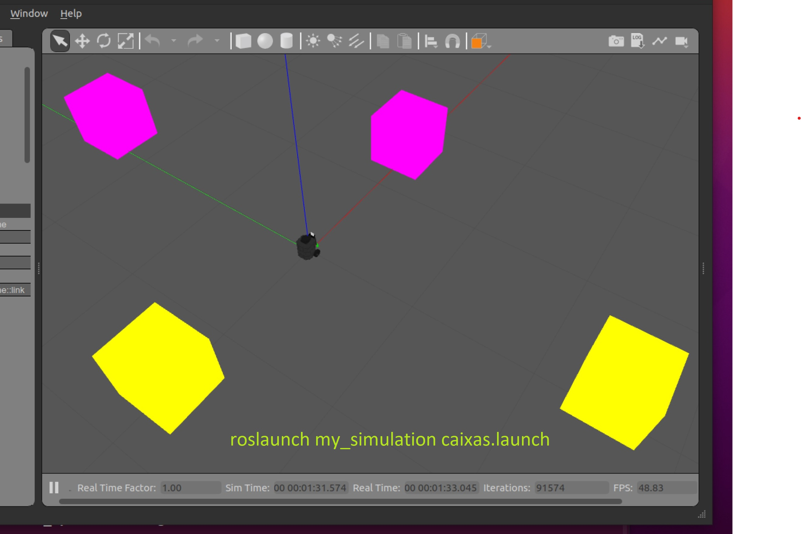

#### Dicas

Talvez estes conteúdos ajudem:

[Regressão trocando x-y com todos os pixels amarelos https://github.com/Insper/robot21.1/blob/main/aula03/aula03_RegressaoPixelsAmarelos.ipynb](https://github.com/Insper/robot21.1/blob/main/aula03/aula03_RegressaoPixelsAmarelos.ipynb)

[Centro de massa de pixels amarelos](https://github.com/Insper/robot21.1/blob/main/aula03/centro_do_amarelo.py)

#### Detalhes de como rodar

O código para este exercício deve estar em: `p1_211/scripts/Q3.py`

Para rodar, recomendamos que faça:

    roslaunch my_simulation circuito.launch

Depois o seu código:

    rosrun p1_211 Q3.py

|Resultado| Conceito| 
|---|---|
| Não executa | 0 |
| Filtra o amarelo| 0.5|
| Segue a pista com base em centro de massa | 1.33|
| Identifica caixa e para no lugar certo | +1|
| Usa o ângulo da faixa na tela para acelerar quando o robô está em trechos retos da pista | +1|

Casos intermediários ou omissos da rubrica serão decididos pelo professor.

## Questão 4 (3.33 pontos)

</img>

Seu robô está no cenário visível abaixo:

    roslaunch my_simulation caixas.launch

#### O que é para fazer

Faça o robô girar e fazer uma volta completa.

Durante esta volta completa, o robô deve *guardar* a posição da caixa mais próxima da cor desejada.

Depois de completada a volta, o robô deve retornar à posição e terminar centralizado na caixa mais próxima da cor desejada. 

Lembramos que a tabela acima define qual sua cor desejada. 

Você pode começar realizando a volta sem odometria, mas para atingir nota máxima deve guardar o ângulo e retornar a ele usando odometria.

Note que as funções do ROS que convertem para ângulo retornam sempre o ângulo de menor magnitude. Isso significa que ângulos maiores que $180^o$ retornarão negativos e será necessário somar $360^o$ ou $2\pi$ para que a magnitude se torne positiva. 

#### Detalhes de como rodar

O código para este exercício está em: `p1_211/scripts/Q4.py`

Para rodar, recomendamos que faça:

    roslaunch my_simulation caixas.launch

Depois:

    rosrun p1_211 Q4.py

|Resultado| Conceito| 
|---|---|
| Não executa | 0 |
| Faz o robô chegar ao fim de um giro em malha aberta - só com velocidades e tempo | 0.5 |
| Durante o giro guarda em qual ângulo estava a caixa preferncial mais próxima  | 1.2 |
| Usando odometria retorna ao ângulo registrado | 2.0|
| Uma vez retornado ao ângulo, garante que o robô vê a caixa centralizada usando câmera ou laser | 3.33 | 

Casos intermediários ou omissos da rubrica serão decididos pelo professor.